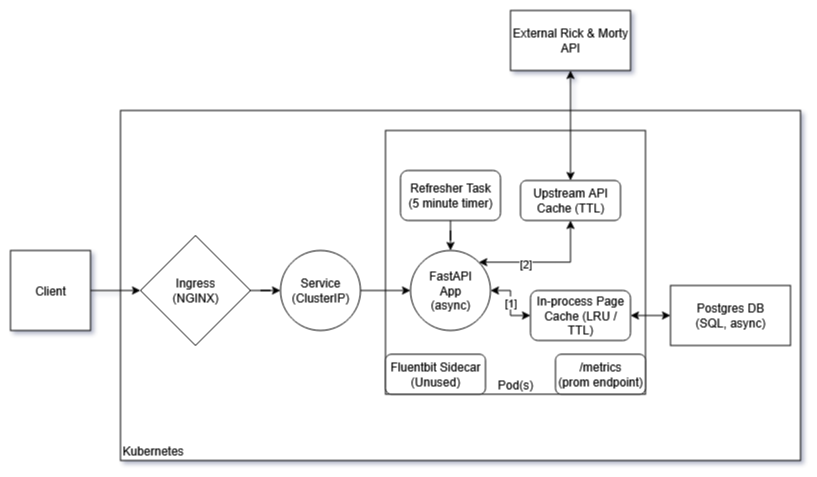

## 📦 Take-Home Requirements Alignment

This section maps the assignment requirements to this project and highlights any optional/bonus pieces, plus how to enable them.

### ✅ What’s implemented

- **FastAPI REST service** exposing:
  - `/characters` with sorting & pagination
  - `/healthz` (liveness), `/healthcheck` (deep health)
  - `/metrics` (Prometheus)
- **Data processing & caching**
  - Pagination + retry for upstream calls
  - Filters applied during ingest:
    - `species == "Human"`
    - `status == "Alive"`
    - `origin` name begins with `"Earth ("` (e.g., `Earth (C-137)`, `Earth (Replacement Dimension)`)
  - Results persisted to DB (Postgres in K8s, SQLite for tests)
  - Background periodic refresh with advisory locking, LRU+TTL page cache in-process for DB + simple upstream cache
  - Rate limiting for API consumers (applied per client-IP via NGINX Ingress Controller)
- **Containerization & Deployment**
  - Docker multi-stage build
  - Helm chart with configurable values (replicas, resources, TTLs, etc.)
  - Kubernetes: Deployment (+HPA), Service (ClusterIP), Ingress
  - Sidecar-ready chart values for log shippers (Fluent Bit/Filebeat)
- **CI/CD (GitHub Actions)**
  - Linting, tests, security scanning
  - Image build & push
  - Kind cluster spin-up, Helm deploy, and e2e tests

### 🟡 Optional / configurable (documented below)
- **`/metrics`** endpoint exposing Prometheus data (latency, cache statistics, dependency statistics)
- **Distributed tracing** via OpenTelemetry (Jaeger/Tempo) (**Note:** skipped due to time)
- **Grafana dashboard** basic JSON (**Note:** skipped due to time)
- **Prometheus alert rules** (3+ production-ready alerts)

---

## 🗺️ Architecture



---

## 🧮 Data Processing & Caching Details

- **Ingest pipeline**:
  1. Fetch all pages from upstream with backoff/retry.
  2. Filter to `species="Human"`, `status="Alive"`, `origin` name starts with `"Earth ("` (covers all “Earth (…)" variants).
  3. Cache filtered results in a very simple, in-memory cache to reduce load on upstream API
  4. Upsert into DB.
  5. Invalidate page cache (if page cache fails, request path still hits DB).
- **Serving path** (`/characters`):
  - Singleflight per cache key → only one DB fetch on miss.
  - Errors from cache are swallowed → DB is the source of truth.
  - Returns paging metadata and results; out-of-range pages return empty results with flags set.

---

## 🔭 Distributed Tracing (OTel) — Optional

1) **Install**
```bash
pip install opentelemetry-sdk opentelemetry-exporter-otlp opentelemetry-instrumentation-fastapi
```

2) **Bootstrap (minimal)**
```python
# tracing.py
from opentelemetry import trace
from opentelemetry.exporter.otlp.proto.http.trace_exporter import OTLPSpanExporter
from opentelemetry.sdk.resources import Resource
from opentelemetry.sdk.trace import TracerProvider
from opentelemetry.sdk.trace.export import BatchSpanProcessor

resource = Resource.create({"service.name": "rickmorty-api"})
provider = TracerProvider(resource=resource)
provider.add_span_processor(BatchSpanProcessor(OTLPSpanExporter()))
trace.set_tracer_provider(provider)
```

```python
# main.py
from .tracing import *  # ensure this is imported before app starts
```

3) **Env**
```
OTEL_EXPORTER_OTLP_ENDPOINT=http://jaeger-collector:4318
OTEL_RESOURCE_ATTRIBUTES=service.name=rickmorty-api
```

4) **Helm values (snippet)**
```yaml
otel:
  enabled: true
  endpoint: "http://jaeger-collector:4318"
```

---

## 📊 Grafana Dashboard (JSON) — Optional

- Include a dashboard JSON at `ops/grafana/dashboard.json` with panels for:
  - Request rate by path (`http_requests_total`)
  - p95 latency by path (`histogram_quantile` over `http_request_latency_seconds_bucket`)
  - Cache hit ratio (`page_cache_hits_total / (hits + puts)`)
  - Error rates by status (`rate(http_requests_total{status=~"5..|4.."}[5m])`)
  - DB/Upstream gauges (`db_ok`, `upstream_ok`)
- Add import steps in README or auto-provision via a Grafana configmap in Helm.

---

## 🚨 Prometheus Alerts (examples)

Put this under `ops/alerts/rules.yaml` and wire it in your Prometheus deployment.

```yaml
groups:
  - name: rickmorty-api.rules
    rules:
      - alert: HighErrorRate
        expr: |
          sum(rate(http_requests_total{status=~"5.."}[5m])) 
            / clamp_min(sum(rate(http_requests_total[5m])), 1)
            > 0.05
        for: 10m
        labels: {severity: page}
        annotations:
          summary: "High 5xx error rate (>5% for 10m)"
          runbook: "Check app logs, DB availability, upstream health"

      - alert: HighLatencyP95
        expr: |
          histogram_quantile(
            0.95,
            sum by (le) (rate(http_request_latency_seconds_bucket[5m]))
          ) > 0.5
        for: 15m
        labels: {severity: ticket}
        annotations:
          summary: "p95 latency > 500ms"
          runbook: "Inspect DB pressure, upstream latency, HPA scale"

      - alert: PodCrashLooping
        expr: |
          increase(kube_pod_container_status_restarts_total{container="app"}[10m]) > 3
        for: 10m
        labels: {severity: page}
        annotations:
          summary: "Pods restarting >3 in 10m"
          runbook: "kubectl describe pod; check readiness/liveness probes & pod logs"
```

> Tune thresholds to your SLOs. Add labels (team, service) as needed.
> Other criteria to consider:
- External availability test (is the service up for cients?)
- K8S resource availability (unschedulable pods, node hardware utilization, etc)
---

## 🧪 Test Matrix (what’s covered)

- **Unit tests**: deep coverage of app + logic
- **Integration tests**: live app with in-memory DB; app behavior via mocked external endpoints, health endpoints.
- **E2E (Kind)**: Helm deploy, readiness, basic API checks against the running cluster and app.

---

## 🔐 Secrets & Values (Helm)

Example values you can override (see [values.yaml](deploy/helm/rickmorty/values.yaml) for actual values):

```yaml
image:
  repository: your-dockerhub-user/rickmorty-sre-demo
  tag: latest
  pullPolicy: IfNotPresent

replicaCount: 2

resources:
  requests: {cpu: "100m", memory: "128Mi"}
  limits:   {cpu: "500m", memory: "512Mi"}

hpa:
  enabled: true
  minReplicas: 2
  maxReplicas: 10
  targetCPUUtilizationPercentage: 70
  targetMemoryUtilizationPercentage: 80

cache:
  ttlSeconds: 300
  capacity: 1000

refresh:
  intervalSeconds: 300
  ttlSeconds: 600

logging:
  sidecar:
    enabled: true
    image: "fluent/fluent-bit:2.2"
    configMap: "fluent-bit-config"

secrets:
  existingSecret: ""   # use an existing k8s secret name if set
  db:
    userKey: "DB_USER"
    passKey: "DB_PASSWORD"
    urlKey:  "DATABASE_URL"
```

---

## 🧭 Runbook Pointers

- **Probes**
  - `/healthz` is in-process; keep it as the **liveness** probe.
  - `/healthcheck` touches DB + upstream probe; use it for **readiness**/**startup** probes.
- **Scaling**
  - More pods = more capacity but colder caches. Watch cache hit ratio vs. HPA behavior. In real production, we would move the page cache (and probably the upstream API cache) to an external (maybe vendor-managed) cache, like Redis.
- **Incidents**
  - High 5xx + DB down → serve degraded; app logs will include `db_unavailable` or `db_error` with exceptions.
  - Cache errors are non-fatal; look for `cache_errors_total` and WARN logs, but requests should continue via DB.

---

## 🧾 CI/CD Notes

- **Required secrets** (GitHub Actions):
  - `DOCKERHUB_USERNAME`, `DOCKERHUB_TOKEN`
- **Workflows**
  - `ci.yml`: lint/tests/audit → build → push → kind up → helm install → e2e → trivy image scan
- **Paths**: e2e runs when `app/**`, `deploy/helm/**`, `.github/workflows/**` change.

---

## 🔐 Security & Maintenance Automation

- [ ] **Dependabot enabled** (`.github/dependabot.yml`) for:
  - [ ] pip (runtime + dev)
  - [ ] GitHub Actions
  - [ ] Docker base images
  - [ ] Uses **weekly** schedule and grouped updates
- [ ] **CodeQL scanning** (`.github/workflows/codeql.yml`)
  - [ ] Runs on **Python 3.12** only
  - [ ] Triggers on push to `main`, PRs to `main`, and weekly schedule
  - [ ] `permissions: security-events: write` set in workflow
- [ ] (Optional) Make **CodeQL** a required status check on `main`
- [ ] (Optional) Enable branch protection rules (require CI + CodeQL to pass)

---